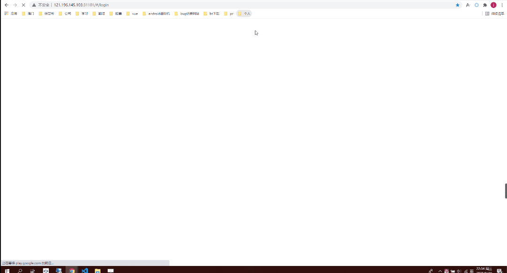
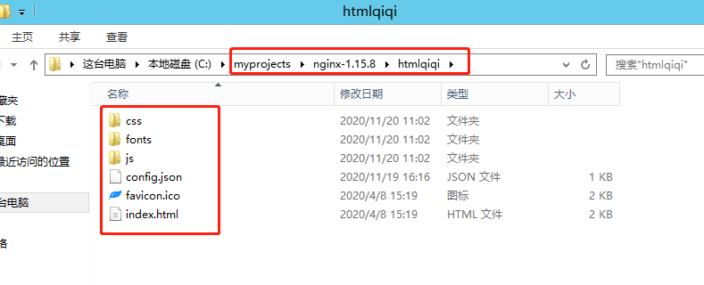

## qiqi-client 后台管理平台

### 系统预览



### 快速开始

1、下载代码到本地

```
git clone https://github.com/owlet-xu/qiqi-project.git
```

2、安装前端依赖
node v10.15.1
npm  6.4.1

```
npm install
```

3、启动开发测试环境

```
npm run start
```

4、建议在chrome浏览器打开本地环境

```
http://localhost:8080
```

### 部署

1、运行指令打包代码

```
npm run build
```

2、dist目录下生成的包拷贝到nginx相关目录中，如下图：



2、nginx中的配置文件nginx.conf

```
	server {
        listen       31101;#默认端口是80，如果端口没被占用可以不用修改
        server_name  localhost;
        #charset koi8-r;
        #access_log  logs/host.access.log  main;
        root        C:/myprojects/nginx-1.15.8/htmlqiqi;#vue项目的打包后的dist 相对路径就exe所在目录的 html
        location / {
            try_files $uri $uri/ @router;#需要指向下面的@router否则会出现vue的路由在nginx中刷新出现404
            index  index.html index.htm;
        }
        #对应上面的@router，主要原因是路由的路径资源并不是一个真实的路径，所以无法找到具体的文件
        #因此需要rewrite到index.html中，然后交给路由在处理请求资源
        location @router {
            rewrite ^.*$ /index.html last;
        }
    }
```

3、启动nginx，并在浏览器访问

```
http://localhost:31101/#/login
```

