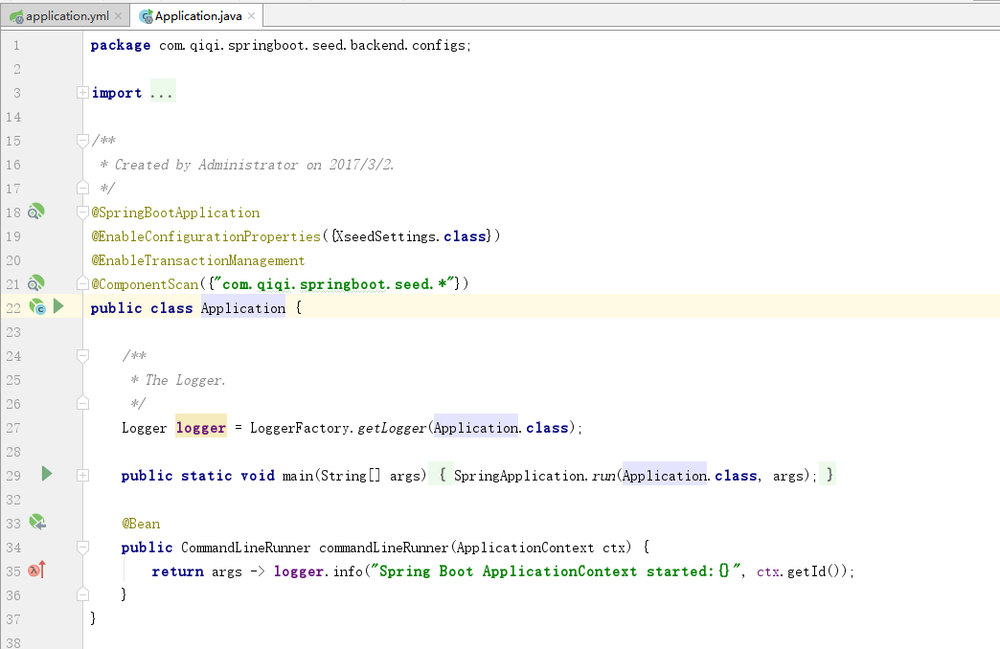

# qiqi-service 后端接口服务

## 服务简介

+ WebApi，Contract，Services，backend合理架构
+ 集成jpa，简单易用，集成方便

### 快速开始

1、下载代码到本地

```
git clone https://github.com/owlet-xu/qiqi-project.git
```

2、用idea引入项目，并配置application.yml

+ 服务端口配置

  ```
  server:
    port: 32100 
  ```

+ 数据库链接配置

  ```
    datasource:
      url: jdbc:sqlserver://169.254.59.111:1433;databaseName=qiqi_sql  #业务数据库访问url
      username: sa      #业务数据库访问用户名
      password: p@ssw0rd #业务数据库访问用户密码
      driver-class-name: com.microsoft.sqlserver.jdbc.SQLServerDriver #数据库访问驱动名称
      hikari:
            maximum-pool-size: 20 # 最大连接数, 默认10
            minimum-idle: 10 # 最小空闲连接数
            max-lifetime: 1800000 # 最大生存期, 默认1800000(30分钟)
    jackson:
      date-format: yyyy-MM-dd HH:mm:ss  #日期序列化格式
  ```

+ redis链接配置

  ```
    redis:
      database: 0
      host: 169.254.59.111
      port: 6379
      password:
      lettuce:
        pool:
           # 连接池中的最大空闲连接 默认8
          max-idle: 8
          # 连接池中的最小空闲连接 默认0
          min-idle: 0
          # 连接池最大连接数 默认8 ，负数表示没有限制
          max-active: 8
          # 连接池最大阻塞等待时间（使用负值表示没有限制） 默认-1
          max-wait: -1ms
      timeout: 3000ms
  ```

  3、在Application.java中启动项目

  

  

  ### 部署

  1、在Terminal命令窗口中打包框架代码

  ```
  gradlew clean build
  ```

  2、在build目录中找到打包后的jar程序

  3、在服务器制作服务

  + centos中

    ```
    nohup java -jar qiqi-service-2.0.0.jar &
    ```

  + windows中

    ```
    // 使用nssm.exe制作windows服务
    ```

    

    

